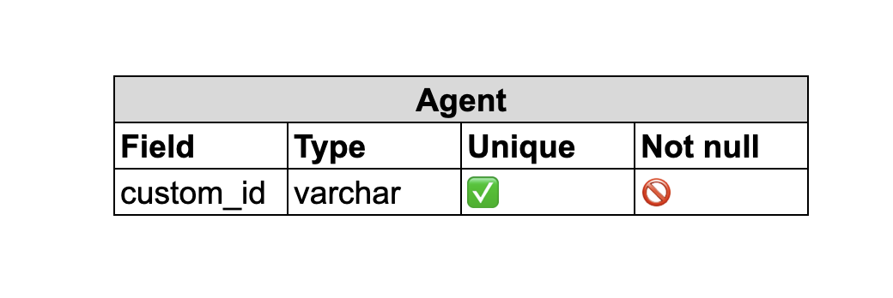
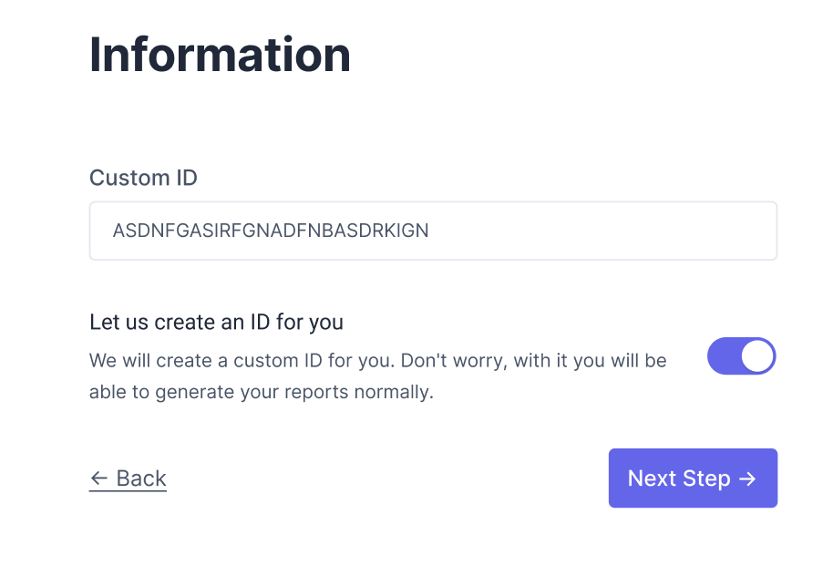

# Ticket Breakdown

We are a staffing company whose primary purpose is to book Agents at Shifts posted by Facilities on our platform. We're working on a new feature which will generate reports for our client Facilities containing info on how many hours each Agent worked in a given quarter by summing up every Shift they worked. Currently, this is how the process works:

- Data is saved in the database in the Facilities, Agents, and Shifts tables
- A function `getShiftsByFacility` is called with the Facility's id, returning all Shifts worked that quarter, including some metadata about the Agent assigned to each
- A function `generateReport` is then called with the list of Shifts. It converts them into a PDF which can be submitted by the Facility for compliance.

## You've been asked to work on a ticket. It reads:

**Currently, the id of each Agent on the reports we generate is their internal database id. We'd like to add the ability for Facilities to save their own custom ids for each Agent they work with and use that id when generating reports for them.**

Based on the information given, break this ticket down into 2-5 individual tickets to perform. Provide as much detail for each ticket as you can, including acceptance criteria, time/effort estimates, and implementation details. Feel free to make informed guesses about any unknown details - you can't guess "wrong".

You will be graded on the level of detail in each ticket, the clarity of the execution plan within and between tickets, and the intelligibility of your language. You don't need to be a native English speaker, but please proof-read your work.

---

## Your Breakdown Here

I thought of splitting this task into 4 tickets:

- Ticket 1: Add custom id field to Agents table
- Ticket 2: Update `getShiftsByFacility` function to use custom id if available
- Ticket 3: Update `generateReport` function to use custom id if available
- Ticket 4: Add API endpoint to update custom id for Agents

### Ticket 1: Add custom id field to Agents table

Add a new column to the Agents table to store the custom id that Facilities can use to identify their Agents. This field should be optional and unique across all Facilities.



Requirements:

- A new column named custom_id has been added to the Agents table in the database.
- The custom_id column is optional and can be null.
- The custom_id column is unique across all Facilities.

For that, we have to do the following steps:

- Run a migration script (or add manually according with the application structure) to add the `custom_id` column to the Agents table.
- Add a validation check to ensure that the `custom_id` is unique across all Facilities.
- Modify any existing queries that reference the Agents table to include the `custom_id` column.

**Time/effort estimate**: 1 hour

---

### Ticket 2: Update `getShiftsByFacility` function to use custom id if available

Modify the `getShiftsByFacility` function to retrieve the custom id for each Agent if it exists, and use it instead of the internal database id when returning the Shifts.

Requirements:

- If the custom id is not available, the internal database id is used instead.

```js
// 🚫 Before
.where("agents.id", agentId);

// ✅ After
.where("agents.custom_id", customId);
```

- Modify the SQL query used by the `getShiftsByFacility` function to include the custom_id field from the Agents table.
- Modify the function to check if the custom_id field is available for each Agent, and use it instead of the internal database id if it exists.
- Add unit tests to ensure that the function is returning the correct data.

**Time/effort estimate**: 3 hours

---

### Ticket 3: Update `generateReport` function to use custom id if available

Modify the generateReport function to use the custom id for each Agent if it exists, and include it in the report instead of the internal database id.

Requirements:

- The `generateReport` function retrieves the custom id for each Agent if it exists and includes it in the generated report.
- If the custom id is not available, the internal database id is used instead.

Modify the function to check if the `custom_id` field is available for each Agent, and use it instead of the internal database id if it exists.
Update the report template to include the `custom_id` field.
Add unit tests to ensure that the function is generating reports with the correct data.

**Time/effort estimate**: 2 hours

---

### Ticket 4: Add API endpoint to update custom id for Agents

Add a new API endpoint that allows Facilities to update the custom id.

Requirements:

- Receive custom_id in request parameters
- Validate amount of characters and if any other user is not using it
- Save the received custom_id for the desired Agent

```
[PATCH] /api/v1/agents

{
    "custom_id": "ABCDEFGHIJKLMNOPQRSTUVWXYZ",
}
```

**Time/effort estimate**: 2 hours

---

### Ticket 5: Add frontend input to save the new `custom_id`

Add a new screen that allows Facilities to update/create the custom id.



Requirements:

- Create the screen using a text input for typing
- Provide option for the system itself to generate the custom ID
- Call API endpoint to save selected custom ID on screen

**Time/effort estimate**: 3 hours
